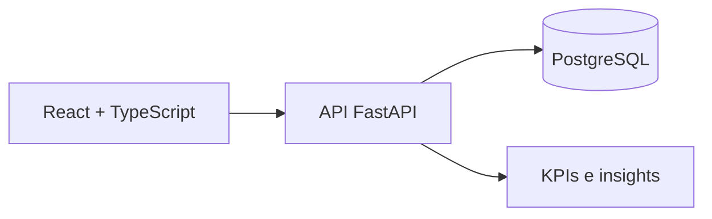

# Business Insights Platform

Plataforma Full Stack para transformar dados operacionais em **KPIs, gráficos, rankings e insights automáticos**. O projeto foi estruturado como um MVP de Business Intelligence com front-end web, API e banco de dados relacional.

> Status: MVP em desenvolvimento.

## Objetivo

Centralizar indicadores de negócio em uma experiência simples e visual, permitindo acompanhar resultados e identificar oportunidades com mais rapidez.

## Funcionalidades

- Dashboard em React com visão de indicadores
- KPIs e gráficos para acompanhamento de desempenho
- Ranking de resultados
- Endpoint para geração de insights automáticos
- API para integração entre interface e dados
- Persistência em PostgreSQL
- Ambiente reproduzível com Docker Compose

## Arquitetura



| Camada | Tecnologias |
|---|---|
| Front-end | React, TypeScript e Vite |
| Back-end | Python e FastAPI |
| Banco de dados | PostgreSQL 16 |
| Infraestrutura | Docker e Docker Compose |

## Como executar

### Banco de dados e API

```bash
docker compose up --build
```

A API ficará disponível em `http://localhost:8000`.

### Front-end

```bash
cd frontend
npm install
npm run dev
```

A interface ficará disponível em `http://localhost:5173`.

## Estrutura

```text
business-insights-plataform/
├── frontend/          # Interface React + TypeScript
├── backend/           # API em Python
├── app/               # Componentes e recursos da aplicação
├── docker-compose.yml # PostgreSQL e backend
└── tarefas.txt        # Evolução planejada do MVP
```

## Próximas evoluções

- Ampliar os indicadores disponíveis
- Criar filtros por período e categoria
- Evoluir a geração de insights automáticos
- Adicionar testes automatizados
- Publicar uma demonstração estável

## Autor

Desenvolvido por [André Luis Ribeiro de Souza](https://github.com/andre09999).

[LinkedIn](https://www.linkedin.com/in/dev-andre-front-end/) • [Portfólio](https://portifoiliowebandre.netlify.app/)
